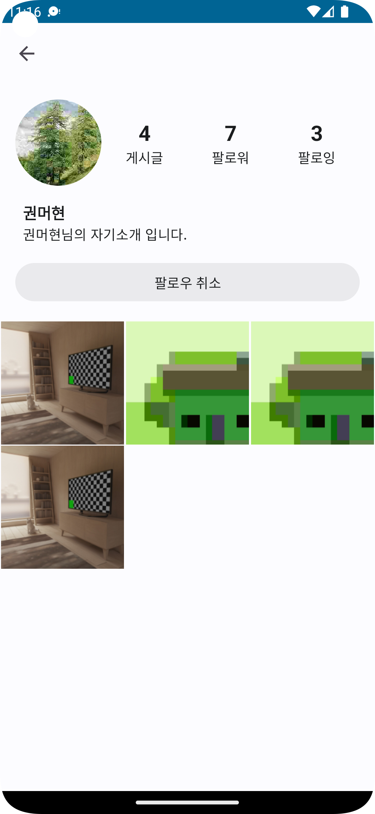

# Hanstargram

한성대학교 3학년 2학기 고급모바일프로그래밍 과목 텀프로젝트에서 구현한 SNS 앱 입니다.

# 앱 스크린샷

| 로그인                          | 홈                          |
|------------------------------|----------------------------|
|  |  |

| 게시글 작성                           | 프로필                              | 검색                             |
|----------------------------------|----------------------------------|--------------------------------|
|  |  |  |

# 워치 앱 스크린샷

| 로그인                                      | 홈                                      |
|------------------------------------------|----------------------------------------|
|  |  |

| 탐색                                           | 프로필                                          |
|----------------------------------------------|----------------------------------------------|
|  |  |

# 기타

## 작업 순서

- 해당 이슈 본인에게 할당(없으면 생성)
- 브런치 생성(feature/foo-bar)
- 커밋, 커밋, 커밋
- PR 생성
    - Resolve 혹은 Fix 키워드를 본문에 삽입하여 자동 이슈 닫도록 함
- CI 통과
- 머지 into main
- 브런치 제거
